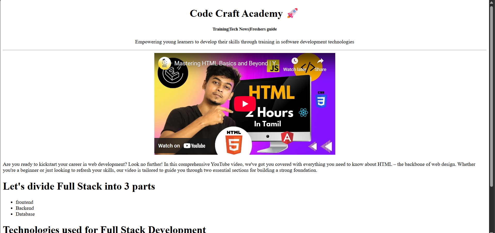

 # 💻 Code Craft Academy

**Code Craft Academy** is a beginner-friendly web project built using **HTML**.  
It is designed to help freshers and learners explore **Full Stack Development basics** through tutorials, training resources, and a registration form.

---

## 📌 Features
- 🎓 **Learning Resources** – Embedded YouTube video tutorials on HTML basics.  
- 📝 **Registration Form** – Collects user details (name, age, gender, email, course, resume).  
- 📰 **Training & Tech News Section** – Helps freshers stay updated.  
- 🎨 **Minimal UI** – Clean design with simple HTML and inline styling.


In the second project, we will dive deeper into HTML by focusing on two important components: Tables and Forms. Tables are used to present data in a structured format, while forms are essential for user input and data submission. Throughout this project, you will learn to use the following HTML elements:

- Table Tag: `<table>`
- Table Row Tag: `<tr>`
- Table Header Cell Tag: `<th>`
- Table Data Cell Tag: `<td>`
- Form Tag: `<form>`
- Input Tags: `<input>` (various types), `<textarea>`, `<select>`, `<option>`, `<label>`, `<button>`

By the end of this project, you will be proficient in creating tables and forms, and you'll understand how to collect user input and process it.

---

## 📂 Project Structure
```
index.html
register.html
```

---

## 🚀 Getting Started
1. Clone the repository:  
   ```bash
   git clone https://github.com/monikha-19/Code_Craft_Academy.git
   ```
2. Navigate to the project folder:  
   ```bash
   cd "Code_Craft_Academy-main"
   ```
3. Open `index.html` or `register.html` in your browser.  

---

## 🛠️ Technologies Used
- **HTML5**
- **Basic CSS (inline styles)**

---

## 📸 Project Screenshots

### 🏠 Homepage Preview


### 📘 README Snapshot


---


## 🎯 Use Cases
- Freshers learning the basics of web development.  
- Students building **mini-projects** for college.  
- Beginners exploring **HTML forms, embeds, and structure**.  

---

## ⭐ Contribution
Contributions, issues, and feature requests are welcome!  
Feel free to fork this project and improve it.  
 
